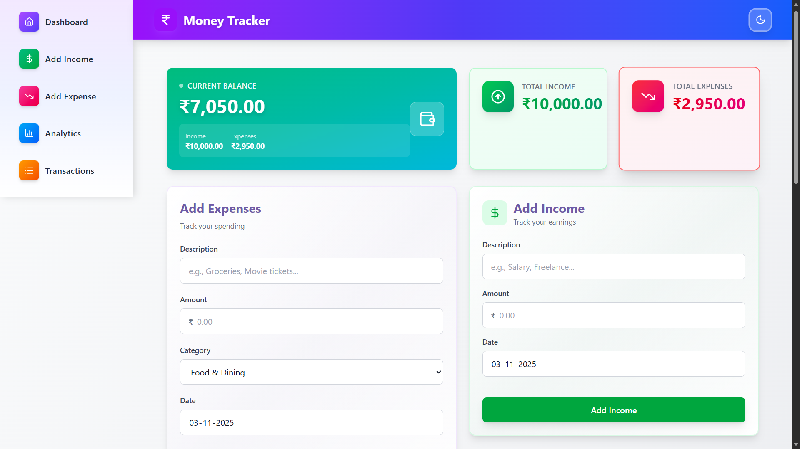
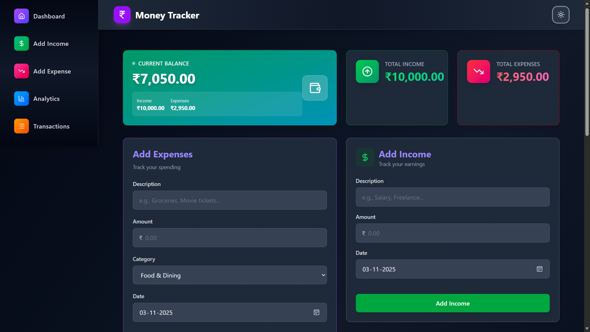

# 💰 Money Tracker

A clean, responsive **Expense & Income Tracker** built with **React** — helping you visualize where your money goes and how much you save.  
Includes dark mode, persistent storage, charts, and a modern UI designed with Tailwind CSS.

---

## ✨ Features

- 📊 **Interactive Analytics:** Visualize your income and expenses with beautiful charts (Recharts).
- 💾 **Local Storage Persistence:** Your data stays even after you refresh or close the browser.
- 🌙 **Dark / Light Mode:** Toggle themes instantly using a context-based theme switcher.
- 💸 **Add & Delete Transactions:** Manage both income and expense lists in real-time.
- ⚡ **Toast Notifications:** Clean feedback using `react-hot-toast`.
- 🧭 **Smooth Navigation:** Elegant sidebar with scroll-to-section functionality.
- 🎨 **Modern UI:** Built with TailwindCSS + Lucide icons for a sleek, accessible experience.

---

## 🖼️ Screenshots

| Light Mode | Dark Mode |
|------------|------------|
|  |  |

---

## 🧠 Project Overview

Money Tracker is a simple yet powerful personal finance dashboard.  
It uses **React Context + Reducer** to manage global state for expenses and income, ensuring scalable and maintainable data flow without extra dependencies.

---

## 🧱 Tech Stack

| Category | Technology |
|-----------|-------------|
| Frontend Framework | React (Vite or CRA) |
| Styling | Tailwind CSS |
| Icons | Lucide React |
| Charts | Recharts |
| Notifications | React Hot Toast |
| State Management | React Context + Reducer |
| Storage | LocalStorage |

---

